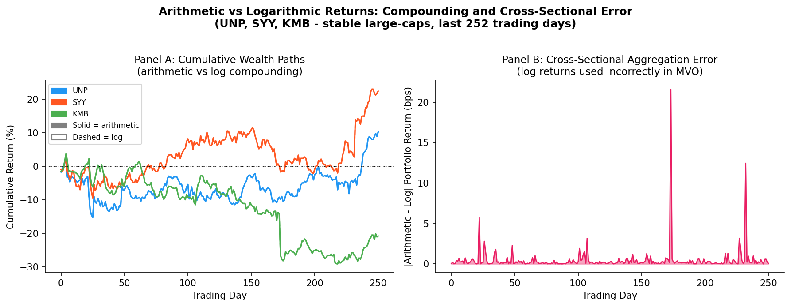
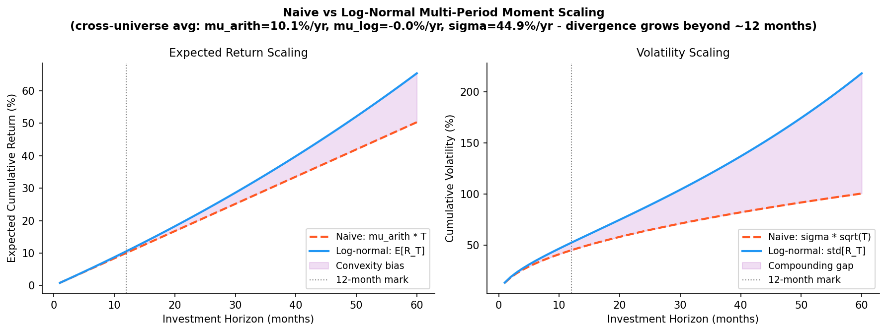
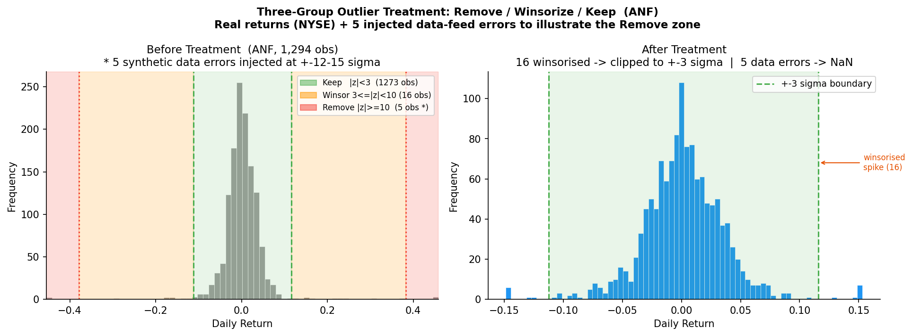
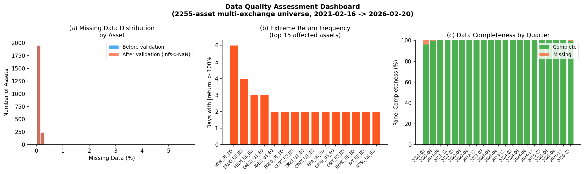
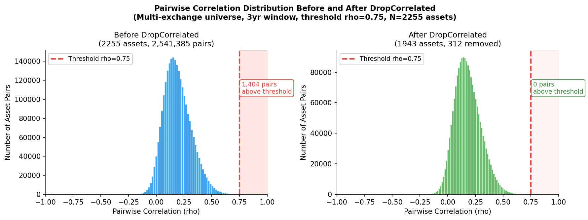
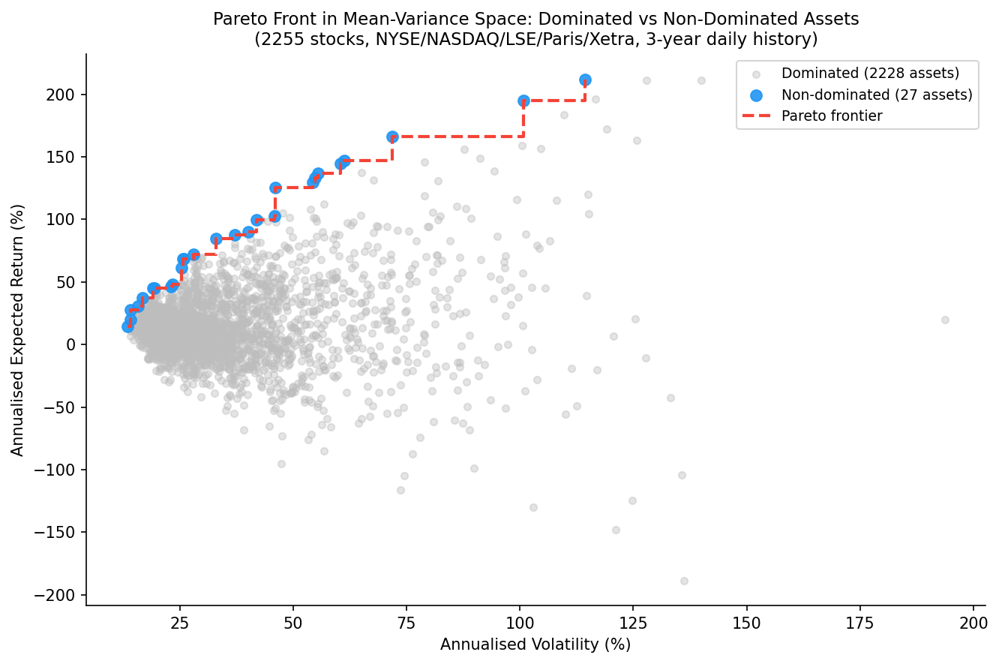
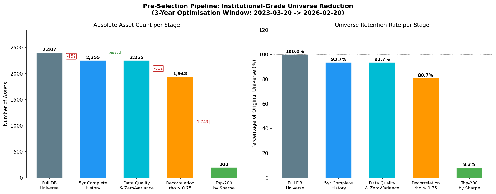

# Data Preparation and Universe Construction

Robust portfolio optimization depends on the quality of its inputs. This chapter establishes the data preparation pipeline that transforms raw price data into a well-conditioned universe suitable for optimization.

## Return Computation and Data Representation

The fundamental input to any portfolio optimization is the matrix of asset returns. Two conventions exist, arithmetic (linear) returns and logarithmic returns, and the choice between them has material consequences for portfolio construction.

**Arithmetic returns** express the fractional change in price over a single period:

$$
r_{i,t} = \frac{P_{i,t}}{P_{i,t-1}} - 1
$$

where $P_{i,t}$ denotes the adjusted closing price of asset $i$ at time $t$. The critical property of arithmetic returns for portfolio optimization is **cross-sectional additivity**: the portfolio return at time $t$ decomposes exactly as a weighted sum of constituent returns,

$$
r_{P,t} = \sum_{i=1}^{N} w_i \cdot r_{i,t}
$$

where $w_i$ is the weight assigned to asset $i$. This identity holds exactly and enables the familiar representation of portfolio expected return as $\mathbb{E}[r_P] = \mathbf{w}^\top \boldsymbol{\mu}$ and portfolio variance as $\sigma_P^2 = \mathbf{w}^\top \boldsymbol{\Sigma} \mathbf{w}$, on which the entire mean-variance apparatus depends.

**Logarithmic returns** are defined as:

$$
r_{i,t}^{\log} = \ln\!\left(\frac{P_{i,t}}{P_{i,t-1}}\right)
$$

Log returns aggregate across time by simple addition, a consequence of the telescoping property of logarithms:

$$
\ln\!\left(\frac{P_T}{P_0}\right) = \sum_{t=1}^{T} \ln\!\left(\frac{P_t}{P_{t-1}}\right)
$$

This temporal additivity makes log returns convenient for multi-period compounding analysis and for statistical modeling under the assumption of normally distributed innovations. However, log returns do **not** aggregate across assets: $\ln(1 + r_P) \neq \sum_i w_i \ln(1 + r_i)$. This violation of cross-sectional additivity renders log returns unsuitable as direct inputs to portfolio optimization. Using log returns in a mean-variance optimizer produces incorrect portfolio returns and misleading risk estimates.

_Figure 17: Cumulative arithmetic vs. log returns for three NYSE stocks (left) and the resulting cross-sectional aggregation error in basis points when log returns are used as MVO inputs (right)._

**Example 17.1 — 3-asset arithmetic aggregation error.**

Consider a portfolio with weights $\mathbf{w} = (0.5,\ 0.3,\ 0.2)$ and single-period arithmetic returns $r = (+10\%,\ {-5\%},\ +3\%)$.

_Correct arithmetic aggregation:_

$$r_P = 0.5 \times 0.10 + 0.3 \times (-0.05) + 0.2 \times 0.03 = 0.050 - 0.015 + 0.006 = \mathbf{4.10\%}$$

_Incorrect log-return aggregation:_

$$\tilde{r}_P = \exp\!\left(0.5\ln(1.10) + 0.3\ln(0.95) + 0.2\ln(1.03)\right) - 1$$

$$= \exp\!\left(0.5 \times 0.09531 - 0.3 \times 0.05129 + 0.2 \times 0.02956\right) - 1$$

$$= \exp(0.04766 - 0.01539 + 0.00591) - 1 = \exp(0.03818) - 1 \approx \mathbf{3.89\%}$$

The discrepancy is **21 basis points** for a single period. This bias accumulates over time and grows with return volatility.

The log-return aggregation error is always negative (log-based understates portfolio return) because $\ln(1+r) \leq r$ by Jensen's inequality.

**Multi-period scaling** of return moments introduces a further subtlety. The naive approach of scaling mean returns linearly with the horizon ($\mu_T = T \mu$) and volatility by the square root of time ($\sigma_T = \sigma \sqrt{T}$) relies on the assumption of independent and identically distributed returns. While this approximation is serviceable for short horizons, it introduces systematic error for horizons exceeding one year, where compounding effects, mean reversion, and volatility clustering become material.

The correct approach assumes **log-normal price dynamics**, under which the multi-period gross return follows from the continuously compounded return distribution. Specifically, if single-period log returns are normally distributed with mean $\mu$ and variance $\sigma^2$, then the expected cumulative arithmetic return over horizon $T$ is:

$$
\mathbb{E}[R_T] = \exp\!\left(\mu T + \frac{1}{2}\sigma^2 T\right) - 1
$$

and the variance of the cumulative arithmetic return is:

$$
\text{Var}[R_T] = \exp\!\left(2\mu T + \sigma^2 T\right)\left(\exp\!\left(\sigma^2 T\right) - 1\right)
$$

These expressions capture the convexity adjustment arising from compounding and correctly propagate uncertainty over extended horizons.

_Figure 19: Naive linear/sqrt-of-time scaling (dashed) versus exact log-normal compounding (solid) for expected return (left) and volatility (right) across horizons of 1-60 months. The shaded area is the convexity bias, which grows beyond the 12-month mark._

**Example 19.1 — S&P 500 10-year compounding bias.**

Given daily log-return parameters $\mu = 0.08/252 \approx 3.17 \times 10^{-4}$ per day and $\sigma = 0.16/\sqrt{252} \approx 1.008\%$ per day, consider a 10-year horizon $T = 2520$ trading days.

_Naive scaling (incorrect):_
$$\mu_{\text{naive}} = \mu \times T = 0.08 \times 10 = 80.0\%$$
$$\sigma_{\text{naive}} = \sigma\sqrt{T} = 0.16\sqrt{10} \approx 50.6\%$$

_Log-normal correction (correct):_
$$\mathbb{E}[R_T] = \exp\!\left(\mu T + \tfrac{1}{2}\sigma^2 T\right) - 1 = \exp\!\left(0.80 + \tfrac{1}{2} \times 0.0256 \times 10\right) - 1$$
$$= \exp(0.80 + 0.128) - 1 = \exp(0.928) - 1 \approx \mathbf{152.9\%}$$

The convexity adjustment $\tfrac{1}{2}\sigma^2 T = 12.8\%$ is the extra expected return from compounding that naive linear scaling ignores.

**Gotcha**: inputs to `apply_lognormal_correction` are **log-return** parameters; the output is in **simple-return** space ($\mathbb{E}[R_T] = \exp(\cdots) - 1$). Using arithmetic return means as inputs will double-count the convexity correction.

In practice, adjusted price series are first converted to arithmetic returns for use in downstream estimation. Multi-period adjustment is handled by applying the log-normal compounding correction to both expected returns and covariance estimates before they enter the optimizer. Setting the investment horizon to the target number of periods (for example, 252 for annualization with daily data) ensures that the moments fed into the optimizer reflect the compounding dynamics of wealth accumulation rather than the naive linear scaling assumption.

## Outlier Treatment and Data Cleaning

Financial return data frequently contain anomalous observations arising from data vendor errors, corporate actions improperly adjusted, exchange glitches, or genuine but extreme market events. Failing to address outliers corrupts moment estimates: a single erroneous return of $+500\%$ can dominate a covariance matrix estimated from hundreds of observations. Conversely, indiscriminate removal of genuine extreme returns understates tail risk and biases the portfolio toward insufficient hedging.

A principled **three-group methodology** balances these concerns by applying graduated treatment based on the magnitude of the deviation from the cross-sectional or time-series mean:

1. **Values exceeding 10 standard deviations**: These observations are removed entirely from the estimation sample. Returns of this magnitude almost certainly reflect data errors: erroneous price entries, missing adjustment factors, or transmission failures. Their inclusion would dominate moment estimates regardless of the estimation method employed.

2. **Values between 3 and 10 standard deviations**: These observations are **winsorized** to the $\pm 3\sigma$ boundary:

$$
X_{\text{winsorized}} = \mu + \operatorname{sign}(X - \mu) \times 3\sigma
$$

Winsorization preserves the direction and approximate timing of extreme returns while capping their influence on moment estimates. Unlike truncation (which discards the observation entirely), winsorization retains the data point and its ordinal rank, reducing distortion in correlation estimates.

3. **Values within 3 standard deviations**: These observations are retained without adjustment. They represent the core distribution of returns from which moments are estimated.

The thresholds of 3 and 10 standard deviations reflect a balance between robustness and information loss. Under a Gaussian distribution, returns beyond $3\sigma$ occur with probability $0.27\%$, roughly once per year for daily data. Returns beyond $10\sigma$ have vanishing probability under any reasonable model and warrant removal.

_Figure 21: Return distribution before (left) and after (right) three-group outlier treatment: green = kept ($|z|<3$), orange = winsorized ($3 \le |z|<10$), red = removed ($|z|\ge 10$)._

**Example 21.1 — Zone identification and winsorization.**

Given an estimated mean $\mu = 0.0005$ and standard deviation $\sigma = 0.02$, consider the following observations:

| Return | z-score | Zone          | Treated Value             |
| ------ | ------- | ------------- | ------------------------- |
| −0.020 | −1.025  | Keep          | −0.0200                   |
| +0.520 | +25.975 | **Remove**    | NaN                       |
| +0.010 | +0.475  | Keep          | +0.0100                   |
| −0.085 | −4.275  | **Winsorize** | $\mu - 3\sigma = -0.0595$ |
| +0.065 | +3.225  | **Winsorize** | $\mu + 3\sigma = +0.0605$ |
| −0.850 | −42.525 | **Remove**    | NaN                       |
| +0.001 | +0.025  | Keep          | +0.0010                   |
| −0.007 | −0.375  | Keep          | −0.0070                   |
| +0.250 | +12.475 | **Remove**    | NaN                       |
| +0.045 | +2.225  | Keep          | +0.0450                   |

Three observations are removed (z-scores of 25.97, −42.53, 12.47) and two are winsorized to the $\pm 3\sigma$ boundaries.

**Missing data imputation** arises when assets have sporadic gaps in their return histories (holidays in one market but not another, trading halts, or data vendor outages). Simple approaches such as zero-fill or forward-fill introduce biases: zero-fill deflates volatility estimates, while forward-fill creates artificial serial correlation. More principled methods include imputation from sector or industry averages (preserving cross-sectional relationships) and regression-based prediction from correlated factors (preserving the covariance structure of the broader universe).

**Survivorship bias** constitutes one of the most insidious data quality issues in historical analysis. If the estimation sample includes only assets that survived to the present, historical return and risk estimates are upwardly biased, because the worst-performing assets (those that delisted, defaulted, or were acquired at distressed valuations) are systematically excluded. Proper treatment requires including delisted stocks in the historical sample with correct handling of delisting returns, the final return realized by investors when an asset ceases trading.

**Look-ahead bias** arises when the estimation procedure uses information that was not available to market participants at the time of the investment decision. Accounting data is particularly susceptible: quarterly earnings are reported with lags of several weeks, and point-in-time databases must be used to ensure that only data available as of the estimation date enters the model. Reporting lags must be explicitly accounted for to ensure that all information used in the optimization was genuinely available to market participants at the relevant decision point.

**Data validation** encompasses systematic checks for impossible or inconsistent values: negative prices or volumes, sudden jumps exceeding plausible limits, and inconsistencies across related fields (e.g., a closing price outside the day's high-low range). These checks serve as a first line of defense against data corruption and should be applied before any statistical treatment.

_Figure 23: Data quality dashboard for the multi-exchange universe: (a) per-asset missing-data rates, (b) assets with the most extreme returns flagged by validation, (c) panel completeness by quarter._

## Pre-Selection Pipeline

Before optimization can proceed, the raw universe of assets must be refined through a series of systematic filters that enforce data quality requirements, remove redundancy, and focus the optimization on a well-conditioned set of investable instruments. Each filter addresses a specific pathology that, if left untreated, would degrade optimization quality through numerical instability, spurious diversification, or wasted degrees of freedom on uninvestable assets.

### Complete History Selection

The covariance matrix lies at the heart of virtually every portfolio optimization method. Its estimation requires a complete panel of contemporaneous returns; assets with gaps, late-starting histories, or early terminations introduce missing-value artifacts that corrupt the covariance estimate. Pairwise deletion (estimating each covariance element from whatever overlapping observations exist) can produce a covariance matrix that is not positive semi-definite, violating the fundamental requirement for a valid optimization input.

The most conservative and numerically reliable approach retains only assets with complete return histories across the full estimation window. This filter ensures that the covariance matrix is estimated from a balanced panel, guaranteeing positive semi-definiteness when combined with a sufficient number of observations relative to the number of assets.

### Zero-Variance Filtering

Assets with negligible return dispersion (suspended stocks, instruments with stale prices that have not been updated, or data errors that produce constant price series) contribute no information to portfolio diversification. Worse, their near-zero variance creates **numerical instability** in covariance matrix inversion: the inverse of a matrix with near-zero eigenvalues amplifies estimation noise, producing extreme and unstable portfolio weights.

Removing zero-variance or near-zero-variance assets before covariance estimation eliminates this source of numerical pathology at negligible cost to portfolio opportunity.

### Correlation Filtering

Highly correlated assets provide **redundant diversification**: a portfolio holding multiple assets with pairwise correlations exceeding 0.95 concentrates risk in a single underlying factor despite appearing diversified by asset count. This redundancy inflates the effective dimensionality of the optimization problem without contributing genuine risk reduction, and it exacerbates estimation error in the covariance matrix by introducing near-collinearity.

Systematic correlation filtering identifies all asset pairs whose sample correlation exceeds a specified threshold (typically $\rho > 0.90$ to $0.95$) and drops one asset from each pair, retaining the asset with superior risk-adjusted characteristics (e.g., higher Sharpe ratio, greater liquidity, or lower estimation uncertainty). Typical threshold values range from 0.90 to 0.95, balancing redundancy removal against excessive universe shrinkage.

_Figure 24: Pairwise correlation distribution before (left) and after (right) applying `DropCorrelated` at threshold $\rho=0.75$. The right tail above the threshold disappears after filtering, removing redundant asset pairs._

### Extreme Performance Selection

When the investable universe is large and factor-scoring or signal-generation has been applied, optimization benefits from focusing on a subset of assets with the strongest factor exposures. Rather than optimizing across hundreds or thousands of assets, many of which contribute negligible expected alpha, the universe is reduced to the $k$ highest-ranked (or lowest-ranked, depending on the signal direction) assets.

This concentration serves two purposes. First, it reduces the dimensionality of the optimization problem, improving the condition number of the covariance matrix and the stability of the resulting portfolio. Second, it ensures that optimization effort is allocated to assets where the investment thesis is strongest, rather than diluted across marginal positions.

### Pareto-Optimal Selection

A complementary approach to universe reduction identifies assets that are **Pareto-dominated** in the mean-variance sense. Asset $i$ is Pareto-dominated if there exists another asset $j$ such that:

$$
\mu_j \geq \mu_i \quad \text{and} \quad \sigma_j \leq \sigma_i
$$

with at least one inequality strict. In words, asset $j$ offers equal or higher expected return with equal or lower risk. A dominated asset $i$ is strictly inferior: no rational mean-variance investor would prefer it to $j$ regardless of risk aversion.

Eliminating Pareto-dominated assets removes strictly inferior alternatives from the feasible set without discarding any asset that could contribute to the efficient frontier. The remaining **non-dominated** assets form the Pareto front in the mean-variance plane, and only these need enter the optimizer.

_Figure 25: Assets in annualised return vs. volatility space. Grey points are Pareto-dominated; blue points are non-dominated and trace the Pareto frontier (dashed red step line)._

**Example 25.1 — 5-asset Pareto dominance identification.**

Consider five assets characterised by their annualised expected return $\mu$ and volatility $\sigma$:

| Asset | $\mu$ | $\sigma$ | Dominated by                               | Status            |
| ----- | ----- | -------- | ------------------------------------------ | ----------------- |
| A     | 8%    | 12%      | —                                          | **Non-dominated** |
| B     | 6%    | 15%      | A ($\mu_A > \mu_B$, $\sigma_A < \sigma_B$) | Dominated         |
| C     | 9%    | 18%      | —                                          | **Non-dominated** |
| D     | 7%    | 12%      | A ($\mu_A > \mu_D$, $\sigma_A = \sigma_D$) | Dominated         |
| E     | 10%   | 25%      | —                                          | **Non-dominated** |

Asset B is dominated by A: A offers higher expected return (8% vs 6%) at lower volatility (12% vs 15%). Asset D is also dominated by A: A offers higher return (8% vs 7%) at equal volatility (12% = 12%). Assets A, C, and E survive onto the Pareto front — each is unbeatable on at least one dimension.

### Expiring Asset Filtering

In mixed portfolios that include derivatives, fixed-income instruments, or futures contracts alongside equities, some assets may approach their expiration or maturity date within the investment horizon. Allocating to such assets creates operational complications: the optimizer may assign weight to an instrument that will cease trading before the next rebalancing date, forcing unplanned liquidation and incurring transaction costs.

Filtering out assets whose remaining life is shorter than the investment horizon prevents this mismatch, ensuring that all instruments in the optimization universe remain tradeable throughout the intended holding period.

### Sequential Pipeline Composition

The filters described above compose sequentially, each operating on the output of the previous stage. The complete pre-selection pipeline follows the chain:

$$
\begin{aligned}
&\text{Raw Universe} \\
&\quad \downarrow \quad \text{Complete History Filter} \\
&\quad \downarrow \quad \text{Zero-Variance Removal} \\
&\quad \downarrow \quad \text{Decorrelation} \\
&\quad \downarrow \quad \text{Top-}k\text{ Selection} \\
&\text{Filtered Universe} \quad (n' \ll n) \\
&\quad \downarrow \quad \text{Optimization} \\
&\text{Portfolio}
\end{aligned}
$$

The ordering matters: complete history selection must precede covariance-dependent filters (since the latter require a well-formed return matrix), and correlation filtering should precede dimensionality reduction (since redundant assets inflate the apparent universe size). Extreme performance selection or Pareto-optimal selection typically comes last among the filters, operating on the cleaned and de-duplicated universe to produce the final set of candidates for optimization.

_Figure 27: Universe reduction at each pre-selection stage: 2 407 raw instruments reduced to 200 after history filter, data quality, decorrelation ($\rho>0.75$), and top-200 Sharpe selection. The right panel shows retention as a percentage of the original universe._

The **pipeline architecture** treats this entire chain, from raw price data through filtering through optimization, as a single composite estimation procedure. This design brings three important benefits:

1. **Hyperparameter tuning**: The threshold parameters of each filter (correlation bound, number of extremes to retain, minimum history length) become hyperparameters of the composite estimator, searchable via cross-validation alongside the optimizer's own parameters.

2. **Cross-validation consistency**: When the pipeline is evaluated under walk-forward or combinatorial cross-validation, the filters are re-fitted on each training fold. This prevents information leakage that would occur if filter decisions were made once on the full sample and then held fixed during validation.

3. **Reproducibility and modularity**: Each filter is an independent transformation that can be added, removed, or reordered without modifying the rest of the pipeline. New filters (e.g., liquidity screens, ESG exclusions) integrate by insertion at the appropriate position.

Composing these transformers with a final optimization estimator enables the entire chain to be fitted, evaluated, and scored through a uniform interface.

\newpage
